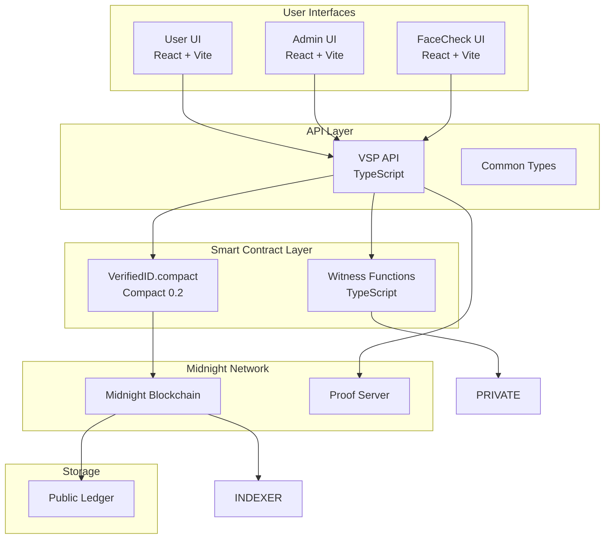

# Veriff Sheriff Protocol (VSP)


A privacy-preserving user-attestation system built on the Midnight Blockchain.
VSP enables secure verification of user attributes such as government IDs, vaccination records, facial data, and financial credibility—without exposing sensitive information on-chain and built in mind with the principle of VERIFY ONCE USE ANYWHERE.

---

## 🌟 Use Cases

- **Buy SIM Cards Privately:**
    Users can purchase SIM cards or mobile connections without exposing their government ID or personal details to telecom providers. The system verifies eligibility using zero-knowledge proofs, keeping sensitive data off-chain and private.

- **Authentication & Verification for Apps:**
    Platforms like LinkedIn, Tinder, and other professional or social apps can require both government KYC and facial verification for user onboarding. VSP enables seamless, privacy-preserving authentication—users prove their identity and liveness without revealing raw documents or facial data to the app which is not trustworthy.

- **Healthcare & Vaccine Data Privacy:**
    Users can store and prove vaccination status or healthcare credentials (e.g., for travel, employment, or events) without exposing underlying medical records. Only the required proof is shared, keeping all sensitive health data safe and private.

---

---

## 🚀 Key Capabilities

**Government Document Verification**  
Attest user identity using official IDs (e.g., passport, TIN-Nigeria, PAN-India, voter ID) with zero-knowledge proofs.

**Travel & Health**  
Store and prove boarding pass and vaccination status (e.g., Yellow Fever) for international travel.

**Facial Verification**  
FaceCheck UI supports private biometric verification for platforms like dating apps, airport check-ins, or professional networks.

**Financial Attestations**  
Evaluate wallet history (e.g., on Etherscan) to prove creditworthiness for loans or financial services—privately.

---

## 🛠 Development Workflow

### Smart Contract Changes

Edit `.compact` circuits under `vsp-contract/src/`.

Compile with:

```sh
npm run install

npm run build
```

### UI Integration

Connect the User UI, Admin UI, and FaceCheck UI after API endpoints are stable.

---

## 📂 Project File Structure

This monorepo is managed with Turborepo and shares dependencies through the root `package.json`.

```
veriff-sheriff-protocol/
│
│
├── vsp-api/
│   └── src/
│       └── index.ts
│
├── vsp-contract/
│   └── src/
│       ├── index.ts
│       ├── VerifiedID.compact
│       ├── witnesses.ts
│       └── managed/
│           └── verifiedid/
│               ├── compiler/
│               ├── contract/
│               ├── keys/
│               └── zkir/
│
└── vsp-ui/
    ├── index.css
    ├── index.html
    ├── main.tsx
    ├── package.json
    ├── tsconfig.json
    ├── vite.config.ts
    ├── components/
    │   ├── AdminPanel.tsx
    │   ├── FaceCheck.tsx
    │   └── UserForm.tsx
    └── src/
        └── App.tsx
```

### Package Overview

- **vsp-api/** – TypeScript backend API service and common types.
- **vsp-contract/** – Smart contract logic (Compact @latest) and witness functions.
- **vsp-ui/** – React + Vite frontends: User UI, Admin UI, and FaceCheck UI.

---

## 🏗 System Architecture



---

## ⚡ Key Design Patterns

- **Witness Functions** – Supply private user data to the smart contract circuits without revealing it publicly.
- **Hash Commitments** – Guarantee data integrity and prevent tampering by storing hash on ledger.
- **Zero-Knowledge Proofs** – Verify attributes like age or creditworthiness without disclosing the underlying documents.

---

# This README was generated by AI and edited according to project needs.

